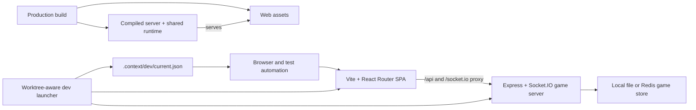

# refactor: Restore a trustworthy Hanabi runtime

## Overview

Rebuild confidence in the existing React/Express Hanabi application without intentionally changing the source-defined game behavior. The work keeps a client-rendered Vite + React Router web app and a long-lived Express + Socket.IO game server, then fixes the development runtime, browser contracts, production artifacts, websocket lifecycle, dependency drift, and missing test coverage that the earlier migration left behind. The live Heroku app is a comparison target when its URL and state are available, but undocumented production drift is not silently imported into the new source baseline.

The execution posture is characterization-first. Browser and protocol behavior must be captured before broad cleanup, and the migration is not complete until two isolated browser sessions visibly play the same game.

---

## Problem Frame

The current tree compiles but does not satisfy the parity and operability claims in `docs/specs/modernization-spec.md`. Fixed ports collide across worktrees; production starts a deleted file; Tailwind and webpack-era globals fail at runtime; first-session socket authentication is unreliable; disconnect cleanup corrupts presence state; formatting and lint fail; and no tests prove game behavior. The rebuild must turn the current source tree into the deployable, testable source of truth while preserving the public game's behavior (see origin: `docs/brainstorms/2026-07-16-hanabi-rebuild-requirements.md`).

---

## Requirements Trace

**Architecture**

- R1. Keep a client-rendered Vite + React Router SPA without TanStack Start or SSR.
- R2. Keep Express + Socket.IO as the long-lived authoritative game process.

**Development runtime**

- R3. Allocate stable, collision-aware ports from the worktree path.
- R4. Publish resolved local URLs in an ignored machine-readable manifest.

**Gameplay and connection parity**

- R5. Preserve current routes, visuals, assets, lobby, gameplay, chat, and reset behavior.
- R6. Make first-session identity and socket authentication reliable in development and production.
- R7. Correct multi-socket disconnect and reconnect lifecycle behavior.

**Production and modernization**

- R8. Produce and start valid production artifacts using Heroku's process model.
- R9. Upgrade compatible dependencies, remove obsolete machinery, and pass repository quality checks.

**Verification**

- R10. Add game-rule, HTTP/socket integration, and browser multiplayer coverage.
- R11. Expose development/production readiness and actionable startup failures.
- R12. Prove the finished flow in two isolated browser sessions with screenshots.

**Origin actors:** A1 (player), A2 (developer), A3 (operator)

**Origin flows:** F1 (local development startup), F2 (multiplayer game), F3 (production deployment)

**Origin acceptance examples:** AE1 (worktree isolation), AE2 (distinct players join), AE3 (turns and reconnect converge), AE4 (production HTTP/socket startup)

---

## Scope Boundaries

- Do not add gameplay features or redesign the interface during parity restoration.
- Do not add SSR, TanStack Start, serverless game handlers, or request-scoped game state.
- Do not replace Socket.IO or redesign the entire message protocol before characterization coverage exists.
- Do not replace React DnD, Redis, or Heroku unless verification proves the existing choice blocks parity.
- Do not preserve tracked build/cache output as a compatibility mechanism.
- Do not deploy to or mutate the live Heroku application without a separate explicit shipping request; this milestone produces and locally proves Heroku-compatible artifacts.

### Deferred to Follow-Up Work

- Add request correlation IDs or acknowledgements and Socket.IO rooms after the parity suite protects behavior. Minimal runtime validation of the existing envelope and payloads is part of this milestone because untrusted clients already reach the authoritative game process.
- Re-evaluate the persistence and hosting architecture after the current deployment is reproducible.

---

## Context & Research

### Relevant Code and Patterns

- `apps/web/vite.config.ts` owns the development proxy but currently hard-codes both ports and omits Tailwind's Vite integration.
- `apps/server/src/main.ts` mixes app construction, listener startup, persistence restore, and process signals, making integration tests and clean readiness difficult.
- `apps/server/src/utils/SocketManager.ts` already centralizes authentication and user/socket maps; it is the narrowest seam for lifecycle correction.
- `apps/web/src/utils/client/SocketManager.ts` and `apps/web/src/utils/client/AuthSocketManager.ts` centralize client connection/authentication behavior.
- `apps/server/src/games/hanabi/HanabiGame.ts` and `packages/shared/src/games/hanabi/HanabiGameData.ts` contain the game rules that need characterization coverage.
- Manavault's `scripts/dev-run.sh`, `scripts/dev-service.sh`, and `.context/dev/current.json` establish the local precedent for stable worktree-derived ports and discoverable runtime URLs.

### Institutional Learnings

- No matching `docs/solutions/` learning exists in this repository. The applicable local instruction is to preserve gameplay, keep websocket connections long-lived, and verify changes with real browser behavior.

### External References

- React Router's mode guidance recommends Declarative Mode for applications that already own their data lifecycle: https://reactrouter.com/start/modes
- Socket.IO documents connection recovery and explicit reconnection testing: https://socket.io/docs/v4/connection-state-recovery
- Playwright browser contexts provide isolated cookies and storage for multi-user scenarios: https://playwright.dev/docs/browser-contexts
- Vitest projects support a single ESM-first test runner across Node-oriented packages: https://vitest.dev/guide/projects

---

## Key Technical Decisions

- Keep React Router in Declarative/Library Mode: websocket state is already managed outside the router, so Framework Mode would add lifecycle concepts without simplifying the application.
- Use one Node development launcher as the source of truth for worktree hashing, collision probing, environment injection, manifest writing, readiness, and signal cleanup. Do not duplicate port algorithms in shell and TypeScript.
- Hash the canonical worktree root plus service name, not the Git branch. Detached worktrees are common and branch names are mutable.
- Refactor server construction away from process startup. Tests must be able to create an app/server on an ephemeral port, and production startup must wait for persistence restore before advertising readiness.
- Bootstrap a signed, opaque session cookie and return a socket token from the same auth request. A browser must not need a failed request merely to receive its first cookie, and a client-supplied cookie value must never become an authenticated player identity without signature verification.
- Use high-entropy, short-lived, one-time socket tokens with bounded issuance and failed-authentication attempts. The existing six-character credential is not an acceptable compatibility contract.
- Validate the existing scoped message envelope and accepted payloads at ingress, including string-length and collection-size limits, before handlers mutate game state. This is boundary hardening, not a protocol redesign.
- Preserve the existing scoped `message` protocol during parity work, but correct socket bookkeeping and test reconnect behavior before any event-shape redesign.
- Build the shared package to a runtime-resolvable package-local output and compile the server to a predictable root artifact. Development resolves shared TypeScript through an explicit development export condition, while production and web builds depend on fresh compiled shared output; production Node must never import workspace `.ts` source by accident.
- Use Vitest for deterministic game/runtime tests. The visible multiplayer proof uses the Codex in-app browser and an independently isolated Chrome session, with screenshots after both players take turns; Playwright reconnect/reset automation is a useful follow-up, not a completion claim for this milestone.

---

## Open Questions

### Resolved During Planning

- TanStack Start versus React Router: keep React Router because SSR is not valuable and the existing app owns realtime state.
- Branch versus worktree port identity: use the worktree path so detached worktrees and branch renames remain stable.
- Rewrite versus preserve Socket.IO: preserve it through parity because the current long-lived server model is appropriate.
- Static web host versus Express for this milestone: serve production assets from Express so the existing Heroku single-process deployment remains reproducible; a split host can be evaluated later.

### Deferred to Implementation

- Exact lint-rule fixes versus narrowly justified rule adjustments: decide from each failure while preserving type-aware linting.
- Whether current browser components expose enough stable accessible names for robust end-to-end locators: add semantic labels where the browser proof reveals gaps.
- Which thin dependencies (`store`, `tailbreak`, `uuid`, request logging helpers) disappear during compatible modernization: remove only when native platform APIs make behavior equivalent and covered.

---

## High-Level Technical Design

> _This illustrates the intended approach and is directional guidance for review, not implementation specification. The implementing agent should treat it as context, not code to reproduce._

---

## Implementation Units

- U1. ✅ **Establish characterization and quality foundations**

**Goal:** Create a fast, trustworthy baseline for game rules and repository checks before changing runtime behavior.

**Requirements:** R5, R9, R10

**Dependencies:** None

**Files:**

- Create: `vitest.config.ts`
- Create: `packages/shared/src/games/hanabi/HanabiGameData.test.ts`
- Create: `apps/server/src/games/server/generateGameCode.test.ts`
- Create: `apps/server/src/games/hanabi/HanabiGame.test.ts`
- Create: `apps/server/test/support/FakeSocketGateway.ts`
- Create: `apps/server/test/support/InMemoryGameStore.ts`
- Modify: `package.json`
- Modify: `packages/shared/package.json`
- Modify: `apps/server/package.json`
- Modify: `.prettierrc.js` or replace with an ESM-compatible Prettier configuration
- Modify: `eslint.config.mjs`

**Approach:**

- Add Vitest as the root ESM-first runner and wire package-aware test targets without introducing separate overlapping test frameworks.
- Characterize deterministic deck creation and game-code generation at their pure boundaries. Drive core legal/illegal actions, scoring/life/clue boundaries, authorization failures, and reset behavior through `HanabiGame`'s public message boundary with narrow fake socket and persistence collaborators.
- Exercise serialization and hydration through the game factory/store boundaries. Live Redis records are not available locally, so a backup and staging restore smoke remain deployment gates.
- Fix the broken Prettier module format immediately; retain type-aware linting and address failures in the files touched by each later unit.

**Execution note:** Add characterization tests before modifying the corresponding game/runtime implementation.

**Patterns to follow:**

- Seeded behavior in `packages/shared/src/utils/shuffle.ts` and immutable serializable data in `packages/shared/src/games/hanabi/HanabiGameData.ts`.

**Test scenarios:**

- Happy path: a fixed seed creates the same deck and player hands on repeated runs.
- Edge case: clue, life, deck, and final-round counters stop at their documented boundaries.
- Edge case: requested game-code lengths, including zero, preserve the current source behavior without throwing; any later validation change is an explicit bug fix rather than mislabeled characterization.
- Error path: an impossible or unauthorized game action is rejected without corrupting state.
- Regression: representative two-player game data serializes and restores without losing IDs or hidden card state.
- Regression: serialized game data hydrates and re-saves without semantic loss; malformed data fails before readiness rather than being overwritten.

**Verification:**

- Root tests run without watch mode in CI, formatting configuration loads, and the initial characterization suite passes against the unmodified game behavior.

- U2. ✅ **Add worktree-isolated development runtime**

**Goal:** Make every worktree start on stable, discoverable, collision-aware ports.

**Requirements:** R3, R4, R11; F1; AE1

**Dependencies:** U1

**Files:**

- Create: `scripts/dev-runtime.mjs`
- Create: `scripts/dev-runtime.test.ts`
- Create: `scripts/dev.mjs`
- Modify: `package.json`
- Modify: `apps/web/vite.config.ts`
- Modify: `apps/server/src/env.ts`
- Modify: `.gitignore`
- Modify: `README.md`
- Create: `docs/dependency-audit.md`

**Approach:**

- Derive preferred ports from the canonical worktree path plus service name in non-overlapping ranges, probe availability from the preferred value with wraparound, and reserve different ports for web and server.
- Export the resolved web port, server port, and server URL before starting Nx targets; configure Vite with `strictPort` and one environment-driven proxy target.
- Write `.context/dev/current.json` atomically with schema version, worktree root, launcher PID, start time, ports, URLs, and state. Remove or mark it stopped during signal-driven shutdown.
- Fail clearly when no port is available or a child process exits, and propagate signals so no orphaned service survives the launcher.

**Patterns to follow:**

- Manavault's worktree hashing, collision scan, manifest contract, and browser URL discovery, reduced to two foreground services and one Node implementation.

**Test scenarios:**

- Covers AE1. Happy path: two different worktree roots produce stable, distinct preferred web/server ports and manifests.
- Edge case: an occupied preferred port selects the next free port and records the actual value.
- Edge case: detached Git HEAD does not affect port stability.
- Error path: exhausting a configured range fails with a concise error and does not write a ready manifest.
- Integration: starting the launcher makes both manifest URLs reachable; terminating it releases both ports.

**Verification:**

- `pnpm dev` uses the launcher, the manifest is the authoritative runtime URL source, and two worktrees can run simultaneously.

- U3. ✅ **Make server startup, sessions, and sockets reliable**

**Goal:** Separate construction from process startup, fix first-session authentication and socket cleanup, and make readiness honest.

**Requirements:** R2, R6, R7, R10, R11; F2; AE2, AE3

**Dependencies:** U1, U2

**Files:**

- Create: `apps/server/src/app.ts`
- Create: `apps/server/src/app.test.ts`
- Create: `apps/server/src/utils/SocketManager.test.ts`
- Modify: `apps/server/src/main.ts`
- Modify: `apps/server/src/env.ts`
- Modify: `apps/server/src/utils/SocketManager.ts`
- Modify: `apps/server/src/games/server/Game.ts`
- Modify: `apps/server/src/games/server/GameManager.ts`
- Modify: `apps/server/src/games/server/GameStore.ts`
- Modify: `apps/server/src/games/server/LocalFileGameStore.ts`
- Modify: `apps/server/src/games/server/RedisGameStore.ts`
- Modify: `apps/server/src/utils/RedisClient.ts`

**Approach:**

- Expose an application/runtime factory that accepts environment and persistence dependencies, constructs Express/HTTP/Socket.IO, restores games, and only then listens and reports readiness.
- In `/api/auth-socket`, create a missing opaque session identity, issue the token for that same identity in one response, and store the identity only in a verified signed cookie with `HttpOnly`, `SameSite=Lax`, and production `Secure` flags. Production refuses the default development signing secret.
- Issue at least 128 bits of entropy per one-time socket token, retain it only for a short explicit TTL, bound outstanding tokens per session, and rate-limit token issuance and failed authentication without turning normal reconnects into lockouts.
- Validate the existing scoped envelope and per-message payloads before dispatch. Reject unknown types/scopes, malformed values, oversized names/chat, and oversized collections without throwing or mutating state.
- Track authenticated sockets by user ID consistently; emit user disconnect only after the user's last socket closes; make reconnect authentication deterministic.
- Serialize saves per game in a tracked promise chain. `GameManager` exposes a bounded flush of all game queues; stores expose `close()` where they own external resources. Save failures remain observable without permanently poisoning later writes, and shutdown stops new work, flushes, then closes HTTP, Socket.IO, timers, and Redis/file resources.

**Execution note:** Start with failing HTTP/socket integration tests for the first-session and multi-socket contracts.

**Patterns to follow:**

- The existing `SocketManager` and `GameManager` remain the behavioral seams; dependency injection is limited to construction and lifecycle, not a new framework.

**Test scenarios:**

- Covers AE2. Integration: a request with no cookie receives a session cookie and usable socket token, then authenticates one client as that session user.
- Security: a tampered or unsigned session cookie cannot mint a token for the claimed player identity; production startup rejects a default signing secret.
- Happy path: two different cookie jars authenticate as different users and join the same game scope.
- Covers AE3. Integration: disconnecting one of two sockets for a user retains presence; disconnecting the final socket emits one user disconnect and removes all socket IDs.
- Error path: an expired or reused auth token receives an explicit authentication error without associating the socket.
- Error path: malformed, unknown, unauthorized, or oversized socket messages are rejected without changing game state or terminating the process.
- Abuse path: issuance and failed-authentication limits reject sustained guessing while an ordinary reconnect obtains and uses a fresh token.
- Error path: store connection/restore failure prevents the listener from reporting ready and closes allocated resources.
- Integration: SIGTERM-style shutdown stops accepting connections and flushes pending persistence work within a bounded interval.

**Verification:**

- Server integration tests use ephemeral ports and real Socket.IO clients; no first request is expected to fail; reconnect leaves no stale socket state.

- U4. ✅ **Repair the browser SPA runtime**

**Goal:** Make the current routes, styling, browser globals, and client connection behavior work under modern Vite/React Router without SSR.

**Requirements:** R1, R5, R6, R9; F2; AE2

**Dependencies:** U1, U2, U3

**Files:**

- Modify: `apps/web/package.json`
- Modify: `apps/web/vite.config.ts`
- Modify: `apps/web/src/main.tsx`
- Modify: `apps/web/src/routes.tsx`
- Modify: `apps/web/src/games/hanabi/client/HanabiRouter.tsx`
- Modify: `apps/web/src/games/hanabi/client/HanabiLobby.tsx`
- Modify: `apps/web/src/styles/tailwind.css`
- Modify: `apps/web/src/utils/client/SocketManager.ts`
- Modify: `apps/web/src/utils/client/AuthSocketManager.ts`
- Modify: browser-global utilities identified by type/lint/browser verification

**Approach:**

- Upgrade Vite, its React plugin, React/React DOM, React Router, and Tailwind as a coherent compatibility set; use the official Tailwind Vite plugin.
- Stay in React Router Declarative Mode and simplify the nested route configuration so the not-found route is reachable without introducing loaders for websocket data.
- Replace webpack-era globals with explicit Vite/browser-safe configuration and native APIs; do not expose server-only environment values.
- Make client connect/auth promises settle on connection errors and timeouts, and preserve automatic authenticated reconnect behavior.
- Preserve a small connection-state contract: initial connection/authentication uses the existing loading treatment; a transient disconnect disables game actions while Socket.IO retries and shows a reconnecting status; successful reauthentication removes the status and refreshes game state; a bounded terminal failure offers an explicit retry and home navigation without discarding the local game URL.
- Replace thin legacy browser helpers only where native platform APIs are simpler and covered; preserve drag/drop and player-facing visuals.
- Add semantic names, visible focus, and the existing click/action-menu alternative for core card actions so automated proof does not depend on coordinates and keyboard users are not forced to drag.

**Execution note:** Use the running app after each browser-facing fix; static type success is insufficient for this unit.

**Patterns to follow:**

- Existing controllers and contexts under `apps/web/src/components` and `apps/web/src/games/hanabi/client` remain the component boundary.

**Test scenarios:**

- Happy path: `/`, `/join`, and a valid `/:code` URL render directly and through client navigation.
- Error path: an unknown nested path renders the 404 experience instead of the Hanabi shell or a blank page.
- Integration: a clean browser connects, authenticates, creates a game, and reaches the lobby without undefined globals or console errors.
- Integration: styles, responsive breakpoints, avatars, drag/drop setup, and audio asset requests load without 404s.
- Error path: server unavailability produces a visible/recoverable disconnected state instead of a permanently pending promise.
- Accessibility: create, join, lobby, reconnect, and one legal turn can be completed with named controls and visible keyboard focus at desktop and narrow viewports.

**Verification:**

- Browser navigation shows the intended styled screens at desktop and narrow widths, and the console has no uncaught errors during create/join flow.

- U5. ✅ **Produce valid production artifacts and modernize dependencies**

**Goal:** Make a clean production build/start reproducible on Node 24 and remove stale artifacts/dependencies that hide failures.

**Requirements:** R8, R9, R11; F3; AE4

**Dependencies:** U1, U3, U4

**Files:**

- Modify: `package.json`
- Modify: `pnpm-lock.yaml`
- Modify: `apps/server/package.json`
- Modify: `apps/server/tsconfig.json`
- Modify: `apps/server/tsconfig.build.json`
- Modify: `packages/shared/package.json`
- Modify: `packages/shared/tsconfig.json`
- Modify: `apps/server/src/main.ts`
- Modify: `Procfile`
- Modify: `.gitignore`
- Modify: `README.md`
- Remove: tracked `dist/` output
- Remove: tracked `.nx/` cache output
- Remove: obsolete package/config files proven unused

**Approach:**

- Build shared runtime JavaScript to a package-local output with source types, compile the server to a predictable artifact, and serve the Vite output from Express in production with SPA fallback.
- Align runtime and type package majors, update direct dependencies to current compatible stable releases, replace UUID with platform `crypto.randomUUID` where equivalent, and remove obsolete middleware/build dependencies.
- Give `@hanabi/shared` explicit development and production export conditions. The dev launcher enables the source condition for `tsx` and Vite; Nx build ordering produces package-local runtime JavaScript before the web/server production builds. A clean development start must not require or consume stale generated output.
- Fix all remaining formatting, typecheck, and lint failures without repo-wide auto-fix in the dirty multi-agent workspace.
- Update the Heroku process and build scripts to use current outputs; exclude all generated build/cache/runtime state from Git.
- Record every outdated direct dependency after the upgrade. Each entry must be upgraded, replaced, removed, or explicitly held with the concrete compatibility blocker and follow-up; transitive drift is reported separately rather than mistaken for direct project ownership.
- Document backup/rollback behavior for persisted records. Without access to live Redis data, backup plus a staging restore smoke remain required before deployment; live deployment is outside this milestone.

**Patterns to follow:**

- Nx dependency ordering between `shared`, `server`, and `web`; Node 24 ESM throughout.

**Test scenarios:**

- Covers AE4. Integration: a clean build followed by the production start command serves `/`, a deep `/:code` URL, `/api/auth-socket`, and a Socket.IO handshake.
- Error path: missing required production configuration fails before listening with an actionable message.
- Regression: production startup imports compiled shared JavaScript rather than TypeScript source or tracked stale output.
- Integration: after deleting generated shared output, development starts from source and observes a shared-code change; production rebuilds shared output before starting Node.
- Integration: file-backed development and Redis-configured production paths both construct against the upgraded client API.
- Compatibility: local serialization/hydration remains stable; production Redis must be backed up and smoke-restored before deployment.

**Verification:**

- Format, lint, typecheck, test, and build pass from the root; the dependency audit has no unexplained direct holds; a clean Heroku-compatible process starts only from generated current artifacts.

- U6. ✅ **Capture multiplayer proof**

**Goal:** Prove parity through two isolated live browser sessions and inspectable evidence.

**Requirements:** R5, R6, R7, R10, R12; F2; AE2, AE3

**Dependencies:** U2, U3, U4, U5

**Files:**

- Create: ignored `artifacts/browser-proof/` screenshots
- Modify: `.gitignore`
- Modify: affected web components when semantic labels are needed

**Approach:**

- Read the development manifest rather than hard-coding ports.
- Use two isolated browser surfaces with separate cookies/storage. Alice creates the game, Bob joins the exact code, Alice starts and discards, then Bob sends chat and discards.
- Capture screenshots from both surfaces in the shared lobby and after both turns. Verify both pages show deck count 38 and the same ordered action history.
- Exercise a fresh cold browser session after the final build and confirm there are no console errors or warnings.

**Execution note:** Browser proof is the completion gate; any failure returns execution to the owning implementation unit.

**Patterns to follow:**

- Isolated browser sessions for multi-user state and `.context/dev/current.json` for URL discovery; never hard-code a port.

**Test scenarios:**

- Covers AE2. Two fresh contexts create and join one code, show distinct player identities, and see the same lobby membership.
- Happy path: the current player and then the next player each discard one tile through the action menu, and both pages display the same score, clues, lives, deck count, and action history after each turn.
- Production: the built app passes the same session/auth/socket smoke flow with Express serving static assets.
- Visual proof: screenshots show both isolated sessions in the shared lobby and after synchronized turns.

**Verification:**

- The in-app browser and a separately isolated Chrome session completed the shared two-player flow. Four screenshots are captured and inspectable; no uncaught browser/server errors occurred. A repeatable Playwright reconnect/reset suite remains a follow-up rather than a completed claim in this milestone.

---

## System-Wide Impact

- **Interaction graph:** The development launcher supplies the web/server environment and manifest; Vite proxies browser HTTP/websocket traffic to Express; Express establishes the session; Socket.IO maps sockets to users; GameManager maps scoped messages to game state and persistence; both browsers consume full refreshed game data.
- **Error propagation:** Startup and restore failures must reject before readiness; client connection/auth failures must reject pending promises and expose recoverable state; persistence failures must be logged and surfaced rather than detached.
- **State lifecycle risks:** Multiple sockets per user, reconnect races, one-time auth tokens, pending saves, timer cleanup, and old manifest/process state are the critical lifecycle boundaries.
- **API surface parity:** `/api/auth-socket`, the Socket.IO path, the scoped `message` envelope, and the existing route URLs remain compatible through the milestone.
- **Integration coverage:** Only real HTTP cookies, real Socket.IO clients, production artifact startup, and two isolated browser contexts prove the cross-layer contracts.
- **Unchanged invariants:** Game rules, saved-game shape, public routes, and player-facing behavior remain stable unless a test demonstrates that the existing behavior is already broken.

---

## Risks & Dependencies

| Risk                                                                                        | Mitigation                                                                                                                                                                                                                     |
| ------------------------------------------------------------------------------------------- | ------------------------------------------------------------------------------------------------------------------------------------------------------------------------------------------------------------------------------ |
| The public Heroku app contains behavior not represented in source or docs                   | Treat current routes and game data as the authoritative source baseline, compare the live app's critical flow when it is discoverable, document observed drift, and avoid silently importing undocumented production behavior. |
| Local production proof misses Heroku-specific buildpack, add-on, routing, and dyno behavior | Describe the result as Heroku-compatible artifact readiness. A staging/live deployment smoke and rollback remain a separate authorized shipping action.                                                                        |
| Existing Redis games may differ from source-defined serialization                           | Require a backup and staging restore smoke before any later deployment; startup fails before readiness instead of overwriting incompatible records.                                                                            |
| Major dependency upgrades obscure existing runtime bugs                                     | Upgrade coherent clusters behind characterization/integration tests, not the entire lockfile blindly.                                                                                                                          |
| Socket reconnect tests are timing-sensitive                                                 | Test observable user/game convergence with bounded web-first waits, not internal transport timing.                                                                                                                             |
| Browser automation cannot operate two visible in-app tabs as isolated users                 | Use isolated automated contexts for repeatability and Computer Use with a separate browser surface for visible proof.                                                                                                          |
| Tracked generated files overlap another agent's work                                        | Remove only known generated paths after confirming Git status; never run destructive cleanup or broad staging.                                                                                                                 |

---

## Phased Delivery

### Phase 1: Trustworthy local baseline

- U1 and U2 establish tests, checks, and worktree-safe runtime discovery.

### Phase 2: Runtime parity

- U3 and U4 fix the server/browser contracts and prove create/join behavior.

### Phase 3: Deployability and proof

- U5 makes production reproducible; U6 automates and captures the final two-player evidence.

---

## Documentation / Operational Notes

- Replace the stale completion claims in `docs/specs/modernization-spec.md` with verified status as each phase finishes, marking completed steps with ✅ and concise implementation notes.
- Document manifest-based local URLs, production build/start, game-store configuration, and the exact verification commands in `README.md`.
- Keep screenshots and traces out of normal source diffs unless a small curated proof artifact is intentionally committed.

---

## Sources & References

- **Origin document:** [docs/brainstorms/2026-07-16-hanabi-rebuild-requirements.md](../brainstorms/2026-07-16-hanabi-rebuild-requirements.md)
- Related code: `apps/server/src/main.ts`
- Related code: `apps/server/src/utils/SocketManager.ts`
- Related code: `apps/web/vite.config.ts`
- Related code: `apps/web/src/utils/client/SocketManager.ts`
- Prior local pattern: `/Users/btraut/Development/manavault/scripts/dev-run.sh` (external repo; intentionally not a portable project link)
- External docs: https://reactrouter.com/start/modes
- External docs: https://socket.io/docs/v4/connection-state-recovery
- External docs: https://playwright.dev/docs/browser-contexts
- External docs: https://vitest.dev/guide/projects
