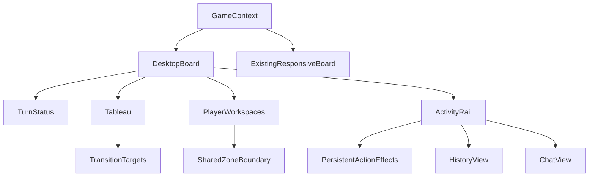
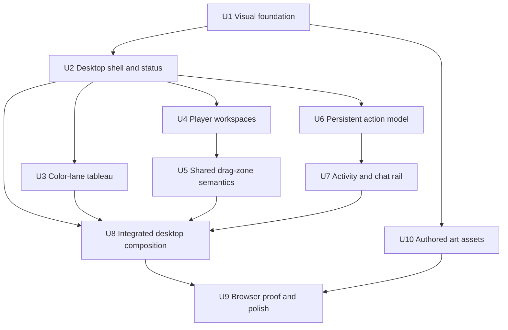
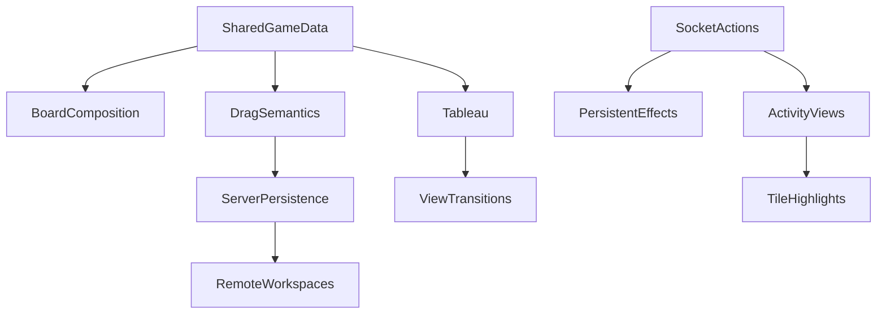

# feat: Redesign the desktop Hanabi game surface

## Overview

Rebuild the in-game desktop surface around the approved 1586×992 visual direction: a midnight-navy table, a compact game header and turn/status band, a left tableau of self-contained color lanes, a center stack of split player workspaces, and a right activity rail. The result must preserve the information density and tactile character of the mock without sacrificing the game state that actually matters: each color's current played tile, every same-color discard in chronological order, all player cards, and all existing actions, highlights, sounds, drag permissions, ordered/freeform behavior, and view transitions. The one intentional drag change is the documented correction that makes the semantic zone boundary match the visible half-height divider.

The desktop composition begins at a deliberate wide breakpoint where all three columns can fit without crushing the 400×140 logical hand surface. The existing sub-desktop composition remains intact for a separate mobile redesign.

| Mode                      | Composition                                  | Intentional behavior                                                                                                            |
| ------------------------- | -------------------------------------------- | ------------------------------------------------------------------------------------------------------------------------------- |
| Wide desktop              | Three-column tableau / hands / activity rail | Full information is simultaneously visible; the page may scroll vertically for maximum player and ruleset states.               |
| Narrow desktop and tablet | Existing responsive board                    | No half-finished approximation of the new desktop surface; behavior stays usable until the mobile/tablet design is implemented. |
| Reduced motion            | Same desktop composition                     | View transitions, pulses, and hover lifts become immediate or static without hiding state.                                      |

---

## Problem Frame

The current desktop board is technically functional but visually reads as a collection of utility panels. Its fixed 488px sidebar combines resources, the tableau, action history, and chat, while player hands sit in a separate column with little hierarchy. The played-tile view renders a redundant one-through-five placeholder ladder for every color, and long discard sequences consume unbounded width. Player hands show the intended upper ordered zone and lower freeform zone only through a background tint; the visual divider is also inconsistent with the drag engine's actual boundary.

The approved direction fixes the hierarchy by making the central game state legible at a glance. It also introduces hard constraints the mock alone does not demonstrate: two through five players, four- and five-card hands, five through seven active color lanes, special purple/rainbow/black-powder colors, zero through ten discards per color, disconnected players, spectators, game-over state, and local concealed cards.

---

## Requirements Trace

- R1. At the wide-desktop breakpoint, render a coherent three-column board: color tableau on the left, player workspaces in the center, and activity/chat rail on the right.
- R2. Preserve the current usable layout below the desktop gate; mobile and tablet redesign are follow-up work.
- R3. Use a consistent midnight-navy, slate, warm-ivory, and coral visual system with crisp focus states and reduced-motion support.
- R4. Give the header, current-turn message, score, deck count, clue count, and life count clear hierarchy without spending a full card on each resource.
- R5. Render one lane per active ruleset color, including purple, rainbow, and black-powder variants.
- R6. In each color lane, show only the current top played tile (or a deliberate empty target), not progress dots, progress numerals, or a one-through-five placeholder ladder.
- R7. In each color lane, show every discarded tile of that color in the exact order it entered the global discard list.
- R8. Keep discard cards a stable readable size: counts one through six use normal spacing; seven through ten progressively tighten into shallow overlap. Never wrap, shrink cards dynamically, reorder, deduplicate, or collapse into `+N`.
- R9. Split every player workspace horizontally into an upper auto-ordered zone and lower freeform zone without visible “Auto” or “Freeform” labels and without duplicating cards between zones.
- R10. Make the visible zone divider and the drag/drop boundary one shared value. Upper-zone drops snap and reorder; lower-zone drops preserve freeform x/y/z placement within bounds.
- R11. Preserve local-hand concealment and drag permission, remote-hand visibility and read-only behavior, tile notes, clue/action affordances, action transitions, sounds, and click-to-highlight behavior.
- R12. Give the active player an unmistakable coral workspace treatment and a concise “Playing” state while retaining disconnected, spectator, and finished-game semantics.
- R13. Recompose the right rail into a persistent latest gameplay action plus History and Chat tabs, with a composer in Chat and a non-disruptive unread count for incoming messages received while Chat is closed.
- R14. Do not unmount or duplicate action sound/highlight effects when switching activity tabs.
- R15. Support the maximum information state without page-level horizontal scrolling: five players, seven color lanes, and ten same-color discards.
- R16. Generate only the reusable visual assets that genuinely require authored art; keep state, numerals, controls, surfaces, shadows, badges, and layout in semantic DOM/CSS.

---

## Scope Boundaries

- Do not redesign the lobby, game-over modal, rules/options forms, or sub-desktop game layout in this epic.
- Do not change Hanabi rules, action authorization, websocket contracts, scoring, or turn order. The only persistence adjustment is an idempotent compatibility normalization for legacy card coordinates in the old divider mismatch band.
- Do not add a webfont, portrait/avatar pack, raster card spritesheet, baked-color card variants, or decorative full-page background image.
- Do not fake timestamps that the action model does not currently store. The activity rail may omit timestamps while retaining the approved hierarchy.
- Do not automatically reorder players each turn. Preserve the current stable/local-first player ordering and indicate the active player visually.

### Deferred to Follow-Up Work

- Mobile game hierarchy, player selector, and bottom-sheet History/Chat treatment: separate responsive redesign after the desktop system is proven.
- Tablet-specific two-pane composition: follow-up responsive work informed by the final desktop and mobile systems.
- Responsive lobby and game-over surfaces: separate scope because they have different state and interaction constraints.
- Optional paper/noise texture: add only if browser review shows the CSS surfaces remain too flat.

---

## Context & Research

### Relevant Code and Patterns

- `apps/web/src/games/hanabi/client/HanabiBoard.tsx` owns the current breakpoint split, player ordering, status composition, and desktop sidebar.
- `apps/web/src/games/hanabi/client/HanabiPlayedTiles.tsx` already filters discards by color without sorting, which preserves the required chronological order. It also owns played/discard view-transition targets that must survive the redesign.
- `apps/web/src/games/hanabi/client/HanabiPlayerTiles.tsx` renders cards on the shared 400×140 coordinate surface and persists freeform positions.
- `packages/shared/src/games/hanabi/HanabiGameData.ts` defines the board/tile dimensions and every supported ruleset color.
- `packages/shared/src/games/hanabi/HanabiDragDropUtils.ts` distinguishes auto-ordered and freeform placement, but its current 58px semantic threshold disagrees with the visible 70px half-height divider.
- `apps/web/src/games/hanabi/client/HanabiActions.tsx` owns `useActionSounds` and `useActionHighlighter`; those effects must remain mounted independently of tab content.
- `apps/web/src/games/hanabi/client/HanabiActionTransition.ts` and `apps/web/src/games/hanabi/client/HanabiActionTransition.test.ts` are the preservation contract for moving played/discarded tiles into the correct destination without duplicates.
- `apps/web/src/games/hanabi/client/HanabiDebugPanel.tsx` provides browser-only state controls, but deterministic maximum-state fixtures will be more efficient for visual verification.

### Institutional Learnings

- Multiplayer acceptance in this repository requires real browser evidence, multiple isolated players when interaction crosses sockets, and reload/deep-link smoke coverage. Static markup tests alone are not completion proof.
- The existing view-transition work is sensitive to destination identity. DOM restructuring must keep a unique target for the newest played tile and newest same-color discard.

### External References

- No external research is required. The redesign uses established React, Tailwind, React DnD, Socket.IO, and existing local component patterns; the product direction is already approved.

---

## Visual Thesis

The game should feel like a modern digital tabletop at night: restrained, tactile, and information-dense. A deep navy background recedes; thin blue-slate borders and slightly lighter panels create structure without card-on-card clutter. Warm ivory tiles become the brightest objects because they are the game pieces. Coral is reserved for the active player, primary focus, and urgent turn state. Each firework color appears in its own lane tint and motif but is always paired with a numeral or text, never used as the sole state cue.

Typography remains the system sans stack. Weight, size, case, and spacing establish hierarchy; no generated font is needed. Surfaces use CSS gradients, inset highlights, fine borders, and controlled shadows. Decorative artwork stays subtle enough that tile numerals remain dominant at 30×36 and 40×48.

### Desktop Content Plan

1. Header: brand mark and live “Hanabi” wordmark on the left; game code/copy affordance and menu on the right.
2. Turn/status band: a concise active-turn statement, then compact score/max, deck, clues, and lives counters.
3. Left tableau: one row per active color with a lane emblem, current played tile, and chronological same-color discard queue. No structural labels.
4. Center workspaces: stable player order, identity rail, active/disconnected treatment, and a 400×140 split card surface for each player.
5. Right activity rail: persistent latest non-chat action, History/Chat tabs with unread state, scrollable content, and chat composer only in Chat.

### Interaction Plan

- Tile dragging and action menus remain on the cards themselves; the redesign changes presentation, not the action model.
- A tile dragged across the shared horizontal divider immediately adopts the destination zone's behavior: ordered placement above, freeform placement below. The hovered half receives a static tint/outline; the upper half previews the insertion slot, while the lower half previews the final clamped ghost position. Reduced-motion removes interpolation, not destination feedback.
- History rows retain hover/focus/click tile highlighting. Effects remain mounted while Chat is selected.
- The unread badge increments only for another player's new chat received while Chat is closed, initializes at zero for existing history, and clears when Chat opens. It pulses once at arrival and respects reduced motion.
- Narrower viewports fall back atomically to the existing composition rather than squeezing or horizontally scrolling the new desktop grid.

---

## Comprehensive Asset Manifest

### Authored visual assets to generate

All source artwork is optimized SVG with transparent backgrounds, no embedded fonts, text, or raster content, and sane square or shared view boxes. Except for the brand mark, assets are monochrome masks/current-color artwork so the application controls color and contrast. Every asset must remain identifiable at its actual 16–64px use sizes.

| Asset                                                                                                                                                                                                                                                                                                          | Runtime path                                         | Purpose and acceptance criteria                                                                                                                               |
| -------------------------------------------------------------------------------------------------------------------------------------------------------------------------------------------------------------------------------------------------------------------------------------------------------------- | ---------------------------------------------------- | ------------------------------------------------------------------------------------------------------------------------------------------------------------- |
| Brand firework mark                                                                                                                                                                                                                                                                                            | `apps/web/public/images/hanabi/brand-mark.svg`       | Fixed multicolor radial firework used beside the live wordmark. Must remain legible at 24–32px and on dark/transparent backgrounds.                           |
| Tile face burst                                                                                                                                                                                                                                                                                                | `apps/web/public/images/hanabi/tile-face-burst.svg`  | Restrained monochrome line-art firework/festival motif used behind visible tile numerals as a CSS mask. Must not compete with the numeral at small tile size. |
| Concealed tile emblem                                                                                                                                                                                                                                                                                          | `apps/web/public/images/hanabi/tile-back-emblem.svg` | Denser monochrome radial rosette for navy card backs, identifiable at 30×36 and 40×48.                                                                        |
| Red lane emblem                                                                                                                                                                                                                                                                                                | `apps/web/public/images/hanabi/tableau/red.svg`      | Monochrome Japanese festival/firework silhouette in the shared optical box.                                                                                   |
| Blue lane emblem                                                                                                                                                                                                                                                                                               | `apps/web/public/images/hanabi/tableau/blue.svg`     | Monochrome torii-inspired silhouette in the shared optical box.                                                                                               |
| Green lane emblem                                                                                                                                                                                                                                                                                              | `apps/web/public/images/hanabi/tableau/green.svg`    | Monochrome bridge/garden-inspired silhouette in the shared optical box.                                                                                       |
| Yellow lane emblem                                                                                                                                                                                                                                                                                             | `apps/web/public/images/hanabi/tableau/yellow.svg`   | Monochrome pagoda-inspired silhouette in the shared optical box.                                                                                              |
| White lane emblem                                                                                                                                                                                                                                                                                              | `apps/web/public/images/hanabi/tableau/white.svg`    | Monochrome castle/lantern-inspired silhouette in the shared optical box.                                                                                      |
| Purple lane emblem                                                                                                                                                                                                                                                                                             | `apps/web/public/images/hanabi/tableau/purple.svg`   | Distinct monochrome lantern/fan silhouette for six-color rulesets.                                                                                            |
| Rainbow lane emblem                                                                                                                                                                                                                                                                                            | `apps/web/public/images/hanabi/tableau/rainbow.svg`  | Distinct monochrome radiating-prism/firework silhouette; CSS supplies multicolor treatment.                                                                   |
| Black-powder lane emblem                                                                                                                                                                                                                                                                                       | `apps/web/public/images/hanabi/tableau/black.svg`    | Distinct monochrome powder-keg/night-firework silhouette; must read against both navy and ivory treatments.                                                   |
| Generate a local review sheet showing the brand mark, both tile motifs, and all eight lane emblems at actual UI sizes on navy and ivory. The review sheet is design evidence, not a runtime dependency. Existing favicon files remain unchanged; application-wide rebranding is outside this in-game redesign. |

### Code-native icons to create or reuse

- Create inline SVG React icons for score/star, deck/card stack, send/paper-plane, and chat bubble under `apps/web/src/games/hanabi/client/icons/`. They inherit `currentColor`, accept the existing icon sizing pattern, and are decorative when adjacent text already names the value.
- Reuse and restyle `Heart.tsx`, `Hamburger.tsx`, `Eye.tsx`, `EyeOff.tsx`, and `MagnifyingGlass.tsx` rather than generating duplicates.
- Render the clue token, unread badge, active-turn ring/bar, copy feedback, and player initials with DOM/CSS.

### Explicitly not generated

- Card numerals, player names, game code, resource counts, action/chat text, and structural labels remain live accessible text.
- The background, panels, card stock, lane tint, divider, border, shadows, focus rings, hover lift, overlap spacing, and grain approximation are CSS.
- Player avatars remain deterministic `boring-avatars`; no portrait set is required.
- Played/discarded/deck state remains data-driven DOM, never a spritesheet or prerendered board image.
- Existing Hanabi sound files remain unchanged.

---

## Key Technical Decisions

| Decision                                                                                                  | Rationale                                                                                                                                  |
| --------------------------------------------------------------------------------------------------------- | ------------------------------------------------------------------------------------------------------------------------------------------ |
| Gate the new composition at a wide content-based breakpoint, initially 1280px.                            | The fixed 400px hand surface, tableau, gaps, and usable activity rail do not honestly fit at the existing 1024px desktop threshold.        |
| Keep one board data model and render desktop-specific composition around existing interaction components. | Avoids forking gameplay logic while allowing a clean responsive boundary.                                                                  |
| Mount exactly one tile-bearing responsive branch at a time.                                               | Hidden duplicate boards would create duplicate interactive surfaces and duplicate `view-transition-name` targets.                          |
| Derive tableau lanes and assets from `getHanabiRuleSetColors`.                                            | Prevents the approved five-color mock from breaking six/seven-color variants.                                                              |
| Preserve discard DOM order and vary only gap/overlap by count.                                            | Chronology is game information; fixed card size preserves numeral legibility and predictable hit targets.                                  |
| Introduce one exported hand-zone boundary shared by CSS and drag/drop logic.                              | Eliminates the current 12px mismatch and prevents future visual/semantic drift.                                                            |
| Separate persistent action effects from History/Chat presentation.                                        | Tab switches must not disable sounds or tile highlighting and must not run those hooks twice.                                              |
| Keep authored art monochrome and tintable wherever possible.                                              | One asset works across rulesets, themes, and density changes without state/size export explosion.                                          |
| Use real action data but omit invented timestamps.                                                        | The current shared action model has no reliable time field; visual fidelity does not justify a protocol migration for decorative metadata. |

---

## Open Questions

### Resolved During Planning

- What happens below the new desktop breakpoint? Preserve the existing composition until the dedicated mobile/tablet work.
- How are seven through ten discards handled? Keep a fixed mini-card size and progressively reduce the inline gap into shallow overlap, retaining DOM and visual chronology.
- Do the upper and lower player zones need labels? No. The divider, tint, and placement behavior communicate the zones.
- Should card progress markers remain? No. The visible top numeral already communicates play progress.
- Are per-color discard headings needed? No. Lane grouping and color/emblem identity communicate the relationship.
- Must variant rulesets receive custom art? Yes. Purple, rainbow, and black-powder lane emblems ship with the base five.
- What happens to the active-player treatment after the game ends? Suppress coral and “Playing”; the finished-game surface has no active player.
- What do empty activity regions show? Latest shows a compact “No moves yet”; History shows “Moves will appear here”; Chat shows “No messages yet. Say hello.” and retains the composer when the viewer may chat.

### Deferred to Implementation

- Exact 1280px grid track sizes and maximum content width: tune against 1280, 1366, 1440, 1586, and 1920 browser captures while preserving the content constraints.
- Exact normal and overlap gap values for discard counts: determine visually with 1, 6, 7, and 10-card fixtures; the behavioral contract above is fixed.
- Whether existing boring-avatar output or a CSS-initial fallback matches the final density better: choose during browser review without changing identity semantics.

---

## High-Level Technical Design

> _This illustrates the intended approach and is directional guidance for review, not implementation specification. The implementing agent should treat it as context, not code to reproduce._

At the breakpoint, presentation branches but state and controllers do not. Exactly one tile-bearing branch is mounted. The desktop tableau consumes the same played/discarded arrays and exposes the same transition targets. Player cards consume persisted coordinates after the one idempotent legacy-band normalization and use one shared boundary constant in both rendering and drag calculations. Action effects sit above tab-specific renderers and subscribe once.

---

## Implementation Units

- U1. ✅ **Build the visual foundation and functional icon set**

**Goal:** Establish reusable tokens, surface treatments, and functional inline icons without blocking layout work on decorative artwork.

**Requirements:** R3, R16

**Dependencies:** None

**Files:**

- Create: `apps/web/src/games/hanabi/client/icons/Star.tsx`
- Create: `apps/web/src/games/hanabi/client/icons/CardStack.tsx`
- Create: `apps/web/src/games/hanabi/client/icons/PaperPlane.tsx`
- Create: `apps/web/src/games/hanabi/client/icons/ChatBubble.tsx`
- Modify: `apps/web/src/styles/tailwind.css`
- Modify: `apps/web/src/games/hanabi/client/HanabiStyles.tsx`
- Test: `apps/web/src/games/hanabi/client/HanabiStyles.test.ts`

**Approach:**

- Define semantic custom properties for table background, panel layers, borders, ivory stock, text levels, coral active state, and supported firework colors.
- Give all inline icons `currentColor` behavior and consistent accessible sizing.
- Expose resilient asset hooks and fallback styles, but defer authored motif integration to U10.

**Patterns to follow:**

- Existing icon components under `apps/web/src/games/hanabi/client/icons/`.
- Existing color mapping in `HanabiStyles.tsx`.

**Test scenarios:**

- Happy path: semantic token classes expose the intended navy, slate, ivory, coral, text, and firework-color values.
- Happy path: all functional icons inherit `currentColor` and accept consistent size/accessibility props.
- Accessibility: reduced-motion and focus-visible token styles remain available without relying on animation or color alone.

**Verification:**

- The shell can use the complete visual system before any decorative SVG is available.

- U2. ✅ **Create the desktop shell, header, turn banner, and compact status HUD**

**Goal:** Establish the desktop page hierarchy and resource presentation without yet integrating the final three feature columns.

**Requirements:** R1, R2, R4, R12

**Dependencies:** U1

**Files:**

- Create: `apps/web/src/games/hanabi/client/HanabiDesktopStatus.tsx`
- Create: `apps/web/src/games/hanabi/client/HanabiDesktopBoard.tsx`
- Create: `apps/web/src/games/hanabi/client/dev/HanabiDesktopFixtures.ts`
- Create: `apps/web/src/games/hanabi/client/dev/HanabiDesktopFixtureView.tsx`
- Create: `apps/web/src/games/hanabi/client/dev/HanabiDesktopFixtures.test.ts`
- Modify: `apps/web/src/games/hanabi/client/HanabiGameView.tsx`
- Modify: `apps/web/src/games/hanabi/client/HanabiRouter.tsx`
- Modify: `apps/web/src/games/hanabi/client/HanabiHeader.tsx`
- Modify: `apps/web/src/games/hanabi/client/HanabiGameMenu.tsx`
- Modify: `apps/web/src/games/hanabi/client/HanabiCopyLinkButton.tsx`
- Test: `apps/web/src/games/hanabi/client/HanabiDesktopStatus.test.ts`

**Approach:**

- Add an explicit game-surface variant to the shared header while keeping the default lobby presentation unchanged. Keep the game header slim and make code/copy/menu controls compact, keyboard reachable, and visually subordinate to the game state.
- Calculate score/max, remaining deck, clues, and lives from existing data helpers and render numeric counters with icons.
- Render a concise active-turn sentence independent of the player workspace so it never disappears below a long stack.
- Add a development-only fixture route, gated by `import.meta.env.DEV`, with named standard, maximum-discard/ruleset, mixed-workspace, activity/chat, spectator, disconnected, and finished data. Render an incremental real `HanabiDesktopBoard` shell rather than a throwaway prototype.
- Before downstream feature work, use that shell to measure the tableau, 400px workspace plus identity rail, and activity tracks at 1280px and 1586px. Move the gate upward if the content does not fit; do not compress the hand surface.

**Patterns to follow:**

- Existing `HanabiRemainingTiles`, `HanabiClues`, and `HanabiLives` data access.
- Existing `HanabiCopyLinkButton` clipboard feedback and `HanabiGameMenu` behavior.

**Test scenarios:**

- Happy path: an in-progress game shows score/max, deck, clues, lives, active-player name, and game code.
- Edge case: local player's turn says “Your turn”; another player's turn names that player; a disconnected active player retains the correct name/state.
- Edge case: zero deck, zero clues, and zero lives render numeric zero rather than disappearing.
- Integration: the lobby and below-wide game header retain their existing default markup and behavior.
- Production boundary: production mode cannot render or navigate to the development fixture route.
- Geometry: the maximum-state shell proves the chosen gate without page-level horizontal scrolling before U3–U8 fill the tracks.

**Verification:**

- At the desktop gate and above, the header/status band consumes materially less vertical space than the old cards, exposes every core resource at a glance, and the browser-backed shell proves the three load-bearing track widths.

- U3. ✅ **Rebuild the tableau as chronological per-color lanes**

**Goal:** Replace the progress ladder with one current played tile and a complete chronological discard queue for every active color.

**Requirements:** R5, R6, R7, R8, R11, R15

**Dependencies:** U1, U2

**Files:**

- Create: `apps/web/src/games/hanabi/client/HanabiDesktopTableau.tsx`
- Create: `apps/web/src/games/hanabi/client/HanabiDiscardQueue.tsx`
- Create: `apps/web/src/games/hanabi/client/HanabiDiscardQueue.test.ts`
- Create: `apps/web/src/games/hanabi/client/HanabiDesktopTableau.test.ts`
- Modify: `apps/web/src/games/hanabi/client/HanabiActionTransition.test.ts`

**Approach:**

- Derive lanes exclusively from the active ruleset color order.
- Find the current played tile for each lane from played state, respecting black-powder's descending sequence, and render one tile or empty target.
- Filter `discardedTiles` by color without sorting; use the filtered array's original order as the DOM and visual order.
- Extract count-to-gap/overlap calculation as a pure helper. One through six remain separated; seven through ten reduce the gap to expose each numeral while fitting the lane.
- Retain unique view-transition names on the actual play/discard destinations and keep highlight/notes wrappers intact.
- Give each visually label-free lane a visually hidden color heading/group name associated with its current-play target and chronological discard list.
- Leave `HanabiPlayedTiles` and `HanabiPlayedTilesCollapsed` as the legacy sub-desktop/default variants.

**Execution note:** Add characterization coverage for color order, transition targets, and discard chronology before replacing the existing placeholder ladder.

**Patterns to follow:**

- Current color derivation and tile rendering in `HanabiPlayedTiles.tsx`.
- Transition-name helpers in `HanabiActionTransition.ts`.

**Test scenarios:**

- Happy path: standard rules render five lanes; each lane renders one current played tile and its own discards in global chronological order.
- Edge case: lanes with zero, one, six, seven, and ten discards render every item; duplicate values remain duplicated.
- Edge case: ten same-color discards keep fixed card dimensions, remain within the lane, and expose every numeral through shallow overlap.
- Edge case: six-color, rainbow, black-powder, and combined rainbow/black-powder rulesets render the exact active lane set and emblem.
- Edge case: black-powder's current played tile follows its descending play sequence.
- Integration: successful play and discard/failed-play transitions still target the correct current lane without leaving a duplicate source tile.
- Accessibility: DOM order matches chronological reading order even when visual overlap is applied.
- Accessibility: an empty lane exposes its color identity and empty current-play/discard state to assistive technology without a visible structural label.

**Verification:**

- No progress dots, progress numerals, or five-card ladders remain, and all 0–10 per-color discards are readable and ordered.

- U4. ✅ **Render split player workspaces and active-player treatment**

**Goal:** Turn each hand into the approved identity rail plus horizontally split ordered/freeform workspace while preserving all card semantics.

**Requirements:** R9, R11, R12, R15

**Dependencies:** U1, U2

**Files:**

- Create: `apps/web/src/games/hanabi/client/HanabiPlayerWorkspace.tsx`
- Modify: `apps/web/src/games/hanabi/client/HanabiBoard.tsx`
- Modify: `apps/web/src/games/hanabi/client/HanabiPlayerTiles.tsx`
- Modify: `apps/web/src/games/hanabi/client/HanabiPlayerAvatar.tsx`
- Test: `apps/web/src/games/hanabi/client/HanabiPlayerWorkspace.test.ts`

**Approach:**

- Keep the 400×140 logical coordinate surface so stored card positions and server semantics remain compatible.
- Move player identity into a compact side rail and make the active workspace coral-bordered with a concise “Playing” badge/state.
- Render one visual divider and a subtle lower-zone tint; omit structural labels.
- Keep local player first, preserve stable ordering after rotation, and retain disconnected/spectator/game-over presentation.
- Cards remain a single collection positioned into either zone, never duplicated or mirrored.

**Patterns to follow:**

- Existing `rotateArrayToItem` ordering in `HanabiBoard.tsx`.
- Existing tile rendering, tooltips, DnD hooks, and transition identities in `HanabiPlayerTiles.tsx`.

**Test scenarios:**

- Happy path: two-, four-, and five-player games render one stable workspace per player and only the active workspace gets the coral treatment.
- Happy path: upper and lower cards render on opposite sides of the divider without “Auto” or “Freeform” text.
- Edge case: four- and five-card hands fit; overlapping lower cards keep their stored z-order.
- Edge case: disconnected players and spectators retain their existing visibility/action rules; finished games suppress coral and “Playing” because no turn is active.
- Integration: local cards remain concealed and eligible for drag only when allowed; remote cards remain face-up and read-only; notes and action tooltips still open.

**Verification:**

- The player column matches the approved split-workspace hierarchy with no change to tile identity or permissions.

- U5. ✅ **Unify visible and semantic hand-zone boundaries**

**Goal:** Make cross-divider drag behavior exactly match the workspace the player sees.

**Requirements:** R9, R10, R11

**Dependencies:** U4

**Files:**

- Modify: `packages/shared/src/games/hanabi/HanabiGameData.ts`
- Modify: `packages/shared/src/games/hanabi/HanabiDragDropUtils.ts`
- Modify: `packages/shared/src/games/hanabi/HanabiGameData.test.ts`
- Create: `packages/shared/src/games/hanabi/HanabiDragDropUtils.test.ts`
- Modify: `apps/web/src/games/hanabi/client/HanabiPlayerTiles.tsx`
- Modify: `apps/web/src/games/hanabi/client/useTileDrop.ts`
- Modify: `apps/web/src/games/hanabi/client/HanabiPlayerTilesDragLayer.tsx`
- Modify: `apps/server/src/games/hanabi/HanabiGameFactory.ts`
- Modify: `apps/server/src/games/hanabi/HanabiGameFactory.test.ts`

**Approach:**

- Introduce one exported zone-boundary constant derived from the logical board height and use it for rendering and all new top/freeform decisions.
- During persisted-game hydration, idempotently shift legacy freeform positions with y values in the old 58–69 mismatch band to the new 70px lower-zone boundary while preserving x/z. Newly created and already-normalized positions remain unchanged.
- Preserve upper-zone x-order insertion and reflow behavior.
- Preserve lower-zone arbitrary x/y placement, z promotion, and board-bound clamping.
- While dragging, statically tint/outline the hovered half, preview the ordered insertion slot above, and preview the final clamped ghost position below; reduced-motion removes interpolation, not destination feedback.
- Characterize server/shared behavior before changing the threshold so the boundary fix cannot lose, duplicate, or eject tiles.

**Execution note:** Implement the shared boundary and cross-zone behavior test-first because this changes persisted gameplay interaction semantics.

**Patterns to follow:**

- Existing pure position helpers in `HanabiDragDropUtils.ts` and client `useTileDrop.ts` delegation.

**Test scenarios:**

- Happy path: dropping just above the boundary snaps/reorders; dropping exactly at or below it preserves freeform placement.
- Happy path: crossing from top to bottom removes the card from ordered reflow without moving unrelated freeform cards.
- Happy path: crossing from bottom to top inserts by x position and reflows ordered cards.
- Edge case: drops at all four board bounds clamp the entire tile inside 400×140.
- Edge case: overlapping lower cards raise the moved tile's z-index without reordering the underlying data unexpectedly.
- Edge case: four- and five-card hands, new-card insertion, and repeated cross-zone moves never lose or duplicate a tile.
- Compatibility: hydrating a legacy y=58–69 freeform position moves it to y=70 exactly once and a second hydration makes no further change.
- Integration: remote clients render the persisted placement and cannot drag another player's tiles.

**Verification:**

- The divider has no dead band or contradictory behavior, and all shared/client tests agree on the boundary.

- U6. ✅ **Separate persistent action effects from feed presentation**

**Goal:** Make sounds, board highlighting, latest-action selection, history, and chat safe to render through independent activity views.

**Requirements:** R11, R13, R14

**Dependencies:** U1, U2

**Files:**

- Create: `apps/web/src/games/hanabi/client/HanabiActionEffects.tsx`
- Create: `apps/web/src/games/hanabi/client/HanabiActionSelectors.ts`
- Create: `apps/web/src/games/hanabi/client/HanabiActionSelectors.test.ts`
- Modify: `apps/web/src/games/hanabi/client/HanabiActions.tsx`
- Modify: `apps/web/src/games/hanabi/client/HanabiBoard.tsx`

**Approach:**

- Mount action sound/highlight hooks once at the board/controller level, independent of the selected activity tab.
- Add pure selectors for latest non-chat gameplay action, full gameplay history, and chat transcript without altering the shared action model.
- Keep rendering components side-effect free so Latest and History may show related data without duplicate sound/highlight subscriptions.

**Patterns to follow:**

- Current `useActionSounds`, `useActionHighlighter`, and `useLatestActions` behavior.

**Test scenarios:**

- Happy path: mixed action/chat input returns the newest non-chat item, ordered gameplay history, and ordered chat transcript.
- Edge case: empty history, chat-only history, and game-action-only history produce stable empty/latest results.
- Integration: switching the future tab content does not remount or duplicate action-effect subscriptions.

**Verification:**

- Existing action sounds and click/hover highlights behave exactly once regardless of which activity content is visible.

- U7. ✅ **Build the desktop Latest, History, and Chat activity rail**

**Goal:** Match the approved right-rail hierarchy while preserving action comprehension and adding scoped unread chat behavior.

**Requirements:** R3, R11, R13, R14

**Dependencies:** U6

**Files:**

- Create: `apps/web/src/games/hanabi/client/HanabiActivityRail.tsx`
- Create: `apps/web/src/games/hanabi/client/HanabiActivityRail.test.ts`
- Modify: `apps/web/src/games/hanabi/client/HanabiActionsPanel.tsx`
- Modify: `apps/web/src/games/hanabi/client/HanabiActionsFilter.tsx`
- Modify: `apps/web/src/games/hanabi/client/HanabiAction.tsx`
- Modify: `apps/web/src/games/hanabi/client/HanabiChatInput.tsx`
- Modify: `apps/web/src/games/hanabi/client/actions/HanabiChatAction.tsx`
- Modify: `apps/web/src/games/hanabi/client/actions/HanabiTileAction.tsx`

**Approach:**

- Keep Latest visible above the tab body and restrict it to meaningful non-chat gameplay actions.
- Render History and Chat as two accessible tabs with independent scroll containers; render the composer only in Chat.
- Initialize unread count to zero at mount. Increment for new messages from other players only while Chat is closed, clear on activation, and never count the local player's own messages.
- Preserve History row focus/hover/click highlighting and all semantic action wording.
- Use a single arrival pulse and a numeric badge; reduced-motion users receive the badge without animation.
- Keep the legacy `HanabiActionsPanel` as the default sub-desktop renderer; desktop-specific markup lives in `HanabiActivityRail`, sharing only effect-neutral action primitives.
- Render compact defined empty states: “No moves yet” for Latest, “Moves will appear here” for History, and “No messages yet. Say hello.” for Chat. The Chat composer remains available when the viewer may send messages.

**Patterns to follow:**

- Existing `HanabiActionsFilter` categories, `HanabiAction` dispatch, and `HanabiChatInput` send path.
- Existing highlight wrappers in tile action components.

**Test scenarios:**

- Happy path: Latest stays visible while History and Chat switch; the composer appears only in Chat and sends through the existing path.
- Happy path: another player's new message increments unread while History is selected and opening Chat clears it.
- Edge case: existing chat history at mount, own new messages, and messages received while Chat is open do not increment unread.
- Edge case: empty latest/history/chat states and long player names/messages remain legible and scroll within the rail.
- Integration: History action focus/click highlights the correct board tile; switching tabs does not stop action sounds or tile transitions.
- Accessibility: tab roles, selected state, keyboard traversal, focus rings, badge accessible name, and disabled composer state are correct.

**Verification:**

- The rail remains usable through long histories and presents gameplay actions as more important than chat without hiding either.

- U8. ✅ **Assemble and responsively gate the three-column desktop board**

**Goal:** Integrate the header/status, tableau, workspaces, and activity rail into the approved wide-desktop composition while preserving the existing narrower board.

**Requirements:** R1, R2, R4, R5, R9, R12, R13, R15

**Dependencies:** U2, U3, U5, U7

**Files:**

- Modify: `apps/web/src/games/hanabi/client/HanabiDesktopBoard.tsx`
- Modify: `apps/web/src/games/hanabi/client/HanabiBoard.tsx`
- Modify: `apps/web/src/games/hanabi/client/HanabiGameView.tsx`
- Test: `apps/web/src/games/hanabi/client/HanabiBoard.test.ts`

**Approach:**

- Compose a desktop-only grid with a bounded tableau track, a center track that honors the 400px logical hand plus identity rail, and a sticky activity track.
- Let the page scroll vertically for five-player/seven-lane states; do not clip the board to viewport height.
- Keep the activity rail sticky only while its scroll behavior remains reachable and keyboard safe.
- Choose the board branch from the existing breakpoint context and mount exactly one tile-bearing composition and one set of play/discard transition targets at any viewport. Do not render both boards and hide one with CSS. Keep shared controllers and the sole action-effects owner above that exclusive branch.

**Patterns to follow:**

- Existing breakpoint styles in `HanabiBoard.tsx` and page framing in `HanabiGameView.tsx`.

**Test scenarios:**

- Happy path: a four-player standard game renders the full three-column hierarchy at the desktop gate.
- Edge case: two-player/five-card, five-player/four-card, disconnected, spectator, and finished states render without missing workspaces or controls.
- Edge case: combined rainbow/black-powder ruleset and ten-card discard lane fit without page-level horizontal scrolling.
- Integration: narrow markup remains available below the gate, while the desktop action effects mount once and transitions resolve to visible destinations.
- Accessibility: source/focus order follows header, status, tableau, workspaces, activity and does not follow a visually misleading sequence.

**Verification:**

- The approved hierarchy is present at 1280px and wider, and one pixel below the gate cleanly uses the prior composition.

- U10. ✅ **Generate and integrate the authored art assets**

**Goal:** Produce the reusable brand, card, and all-ruleset tableau artwork after the functional desktop surface can already be rendered and evaluated.

**Requirements:** R3, R5, R16

**Dependencies:** U1

**Files:**

- Create: `apps/web/public/images/hanabi/brand-mark.svg`
- Create: `apps/web/public/images/hanabi/tile-face-burst.svg`
- Create: `apps/web/public/images/hanabi/tile-back-emblem.svg`
- Create: `apps/web/public/images/hanabi/tableau/red.svg`
- Create: `apps/web/public/images/hanabi/tableau/blue.svg`
- Create: `apps/web/public/images/hanabi/tableau/green.svg`
- Create: `apps/web/public/images/hanabi/tableau/yellow.svg`
- Create: `apps/web/public/images/hanabi/tableau/white.svg`
- Create: `apps/web/public/images/hanabi/tableau/purple.svg`
- Create: `apps/web/public/images/hanabi/tableau/rainbow.svg`
- Create: `apps/web/public/images/hanabi/tableau/black.svg`
- Modify: `apps/web/src/games/hanabi/client/HanabiHeader.tsx`
- Modify: `apps/web/src/games/hanabi/client/HanabiTileView.tsx`
- Modify: `apps/web/src/games/hanabi/client/HanabiDesktopTableau.tsx`
- Test: `apps/web/src/games/hanabi/client/HanabiTileView.test.ts`

**Approach:**

- Generate/author assets to the manifest contract, review them at actual UI size, and optimize final SVG paths before source control.
- Integrate artwork as decorative masks/backgrounds while preserving live numerals, accessible names, and image-disabled fallback.
- Use the brand mark only on the game-surface header variant; do not alter application favicons or lobby branding in this epic.

**Patterns to follow:**

- Optional decorative layers in `HanabiTileView.tsx` and the semantic color mapping established by U1.

**Test scenarios:**

- Happy path: face-up, concealed, and placeholder tiles retain their live state and show the correct optional motif.
- Edge case: red, blue, green, yellow, white, purple, rainbow, and black-powder lanes select distinct art with readable color/numeral treatment.
- Accessibility: decorative art is hidden from the accessibility tree and missing/disabled images do not remove game information.

**Verification:**

- The review sheet proves every asset on navy and ivory at actual size, and the functional layout remains complete without the artwork.

- U9. ✅ **Prove the redesign in real browsers and perform one visual refinement pass**

**Goal:** Validate behavior and appearance across realistic and maximum game states, then correct the highest-impact visual discrepancies.

**Requirements:** R1–R16

**Dependencies:** U8, U10

**Files:**

- Modify as findings require: files owned by U1–U8 and U10 only
- Create: `docs/proof/hanabi-desktop-redesign/README.md`
- Create: `docs/proof/hanabi-desktop-redesign/desktop-standard.png`
- Create: `docs/proof/hanabi-desktop-redesign/desktop-maximum-state.png`
- Create: `docs/proof/hanabi-desktop-redesign/desktop-chat.png`

**Approach:**

- Use the deterministic development fixture route for repeatable visual states and real games for multiplayer behavior; do not add fake data branches to production gameplay components.
- Compare the first 1586×992 capture to the approved visual thesis, identify the single highest-impact mismatch, and make at least one focused refinement pass.
- Exercise real multiplayer behavior with isolated browser identities for drag persistence, chat unread/send, action sounds/highlights, and play/discard transitions.
- Record viewport, fixture/game state, and observed result beside final screenshots.

**Test scenarios:**

- Visual: capture 1280×800, 1366×768, 1440×900, 1586×992, and 1920×1080; no page-level horizontal scroll, clipped rail, or hidden header/status.
- Visual: at 200% zoom, the layout remains navigable and focus indicators remain visible.
- State: verify 2/4/5 players; 4/5-card hands; current user/other/disconnected turns; spectator; finished game.
- Tableau: verify base, six-color, rainbow, black-powder, and combined rulesets with empty/mid/complete plays and 0/1/6/7/10 discards per color.
- Workspace: verify all ordered, all freeform, mixed, overlapping, and every cross-divider/boundary drag.
- Activity: verify empty/long Latest, long History, Chat selected/hidden, unread arrival/clear, long messages, send, and keyboard focus.
- Integration: with two isolated players, play, discard, clue, chat, reload, and deep-link rejoin all preserve correct visible state.
- Accessibility: keyboard-only traversal, semantic labels, non-color state cues, and reduced-motion mode remain usable.
- Cross-browser: smoke Chrome, Firefox, and Safari for DnD, sticky layout, CSS masks, and view transitions/fallbacks.

**Verification:**

- Focused tests plus full test, typecheck, lint, and production build pass.
- Final screenshots and a concise state matrix are committed under `docs/proof/hanabi-desktop-redesign/`.

---

## System-Wide Impact

- **Interaction graph:** Socket game data feeds the desktop board, tableau, hands, and activity selectors. Drag/drop persists shared positions through the existing server path. Action effects and activity presentation consume the same ordered action stream exactly once.
- **Error propagation:** Clipboard and chat send failures retain existing behavior; the redesign must not swallow socket/controller errors. Missing decorative assets degrade to readable state, not a broken tile.
- **State lifecycle risks:** Unread chat is intentionally session-local and starts at zero; it must not count historical messages. Legacy y=58–69 freeform positions normalize idempotently to y=70 during hydration before new shared reflow runs. Transition targets remain unique through an exclusive responsive branch.
- **API surface parity:** No websocket or persisted action schema change is planned. Shared board constants affect both client and server consumers and must remain backward compatible with existing positions.
- **Integration coverage:** Real multi-client verification is required for persisted drag positions, remote action transitions, chat unread/send, reload, and deep-link rejoin.
- **Unchanged invariants:** Rules, scoring, action authorization, websocket shape, player ordering, concealment, tile IDs, notes, and sound/highlight semantics remain unchanged.

---

## Risks & Dependencies

| Risk                                                    | Likelihood | Impact | Mitigation                                                                                                                           |
| ------------------------------------------------------- | ---------: | -----: | ------------------------------------------------------------------------------------------------------------------------------------ |
| The approved composition is too wide at 1280px.         |     Medium |   High | Treat the gate as content-based; tune tracks at real widths and move the gate upward rather than compressing cards below legibility. |
| Long discard queues obscure numerals.                   |     Medium |   High | Fixed-size mini cards, count-derived overlap, numeral exposure tests, and 10-card visual fixtures.                                   |
| DOM restructuring breaks action transitions.            |     Medium |   High | Preserve target naming, extend transition tests, and exercise successful/failed play from two clients.                               |
| Tab rendering disables or duplicates sounds/highlights. |     Medium |   High | Extract one persistent effects owner before building tabs and test subscription stability.                                           |
| Changing the zone boundary surprises saved layouts.     |        Low | Medium | Normalize the legacy 58–69 freeform band to y=70 idempotently during hydration, then use one shared midpoint constant everywhere.    |
| Variant rulesets look unfinished.                       |     Medium | Medium | Generate and test all eight possible color identities, not only the five shown in the mock.                                          |
| Decorative SVGs reduce numeral contrast.                |     Medium | Medium | Use monochrome masks, actual-size review sheet, contrast checks, and readable no-image fallback.                                     |
| Five players create excessive vertical height.          |       High |    Low | Allow intentional document scroll, keep status/rail sticky where safe, and do not compress the logical hand height.                  |
| Existing narrow layout regresses from shared styles.    |     Medium |   High | Scope tokens/components carefully and verify one pixel below the desktop gate after every integration unit.                          |

---

## Alternative Approaches Considered

- Shrink discard tiles as count grows: rejected because card value is critical information and dynamic sizing makes the rare maximum state least readable.
- Reserve fixed width for ten non-overlapping discards: rejected because it makes every normal lane wasteful and forces the entire three-column grid wider.
- Collapse overflow into a stack or `+N`: rejected because it hides discard chronology and values that players need for inference.
- Keep the five-card progress ladder: rejected because the played numeral already communicates progress and the ladder consumes the room needed for chronological discards.
- Build a separate desktop gameplay data/controller tree: rejected because duplicated stateful action/drag logic would create multiplayer drift. Presentation branches; controllers remain shared.
- Bake the mock's artwork into card sprites: rejected because ruleset/color/state combinations would explode the asset matrix and reduce accessibility.

---

## Success Metrics

- A player can identify the active player, score, deck, clues, lives, current top card for every color, and all same-color discards without opening or scrolling a side panel at the canonical desktop viewport.
- The maximum supported discard state renders all ten values per color in chronological order with unchanged card dimensions.
- The visible hand divider and drag behavior agree at every y-coordinate; cross-zone moves neither lose nor duplicate cards.
- No existing action transition, sound, highlight, note, concealment, or authorization behavior regresses.
- The final real-browser screenshots visibly match the approved navy/ivory/coral hierarchy and pass the documented viewport/state matrix.

---

## Documentation / Operational Notes

- Add browser-proof screenshots and state notes under `docs/proof/hanabi-desktop-redesign/`.
- Keep the comprehensive asset contract in this plan so future visual changes do not reintroduce per-color rasters or omit variant rulesets.
- No database migration, environment variable, deployment configuration, or rollout flag is required.
- Persisted games receive the one idempotent coordinate normalization described in U5; no websocket or stored-data schema change is required.
- This is a desktop-only release slice. The fallback breakpoint preserves the old mobile/tablet surface until the responsive follow-up lands.

---

## Sources & References

- Approved desktop visual direction: 1586×992 mock from the product-design conversation, fully restated in this plan's Visual Thesis, Content Plan, and Asset Manifest.
- Related requirements: `docs/brainstorms/2026-07-16-hanabi-rebuild-requirements.md`
- Related transition requirements: `docs/brainstorms/2026-07-18-tile-action-transitions-requirements.md`
- Related code: `apps/web/src/games/hanabi/client/HanabiBoard.tsx`
- Related code: `apps/web/src/games/hanabi/client/HanabiPlayedTiles.tsx`
- Related code: `apps/web/src/games/hanabi/client/HanabiPlayerTiles.tsx`
- Related code: `apps/web/src/games/hanabi/client/HanabiActions.tsx`
- Related shared logic: `packages/shared/src/games/hanabi/HanabiDragDropUtils.ts`
