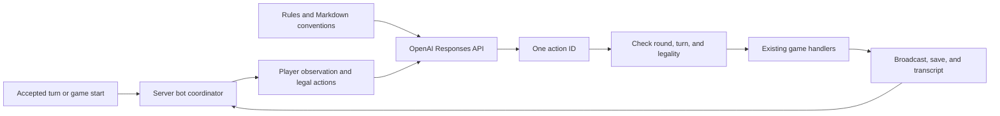

# Server-run Hanabi bots with editable instructions

## Outcome and scope

A human can add a bot in the lobby, start a game, and have the server ask OpenAI to choose a legal action whenever that bot's turn arrives. The bot receives only information available to its seated human equivalent. Brent can improve its behavior by editing a Markdown conventions file without changing game code.

The POC is implemented and verified locally. Its API key is provisioned locally and staged on Railway without deploying the POC or changing the production bot flag. Production release and live production acceptance are deferred. The unrelated game-review requirements document is outside this work.

The first release supports multiple bot seats within the existing five-player limit, a shared operator-controlled prompt, all existing rule sets, and normal game persistence. It does not include a prompt editor, per-lobby prompt overrides, chat participation, automated training, a solver, or an evaluation dashboard. Winning consistently is a later prompt-development objective; legal, fair, reliable play is this release's acceptance bar.

## Requirements

| ID  | Requirement                                                                                                             | Implementation |
| --- | ----------------------------------------------------------------------------------------------------------------------- | -------------- |
| R1  | A joined game creator can add/remove bot seats in Setup; everyone can recognize bot players.                            | U2, U6         |
| R2  | Model requests contain only the acting player's permitted knowledge; no hidden-card shortcuts.                          | U1, U3         |
| R3  | On each bot turn the server obtains and validates one legal action, then uses normal game execution.                    | U1, U4         |
| R4  | Editable Markdown instructions supplement fixed game rules and the action contract; running rounds retain their policy. | U3, U5         |
| R5  | Reuse the OpenAI key from ManaVault Doppler; keep it server-only locally and on Railway.                                | U3, U7         |
| R6  | Failures, resets, reconnects, restarts, and shutdown cannot cause duplicate or stale moves.                             | U2, U4, U5, U6 |

## Repository integration

`HanabiGame.ts` owns authoritative turns and recipient-specific visibility. Bot execution invokes the regular play/discard/clue handlers with an explicit actor through a server-owned coordinator. Development debug controls remain development-only.

`HanabiLobby.tsx` already renders the roster and start controls. The server already enforces creator-only debug-player creation, the five-player cap, and creator removal of other players in Setup. Any seated human may currently start/reset; preserve those permissions.

`env.ts` loads `apps/server/.env` and then the repository `.env`. The server package uses the official OpenAI SDK. `runtime.ts`, `HanabiGameFactory.ts`, and `GameManager.ts` provide dependency injection, restore, prune, and shutdown hooks. `GameTranscript.ts` records accepted moves and contains privileged deck information.

Live checks confirmed the linked Railway project is `hanabi`, with `hanabi`, `Redis`, and `Postgres` services. `OPENAI_API_KEY` from Doppler project `manavault`, config `dev_api` authenticated successfully with `gpt-5.4-mini-2026-03-17`, including two real gameplay turns. Repository deployment configuration requires one application replica with no overlap.

## Technical direction

Keep the bot coordinator inside the existing Node server. A synthetic browser/socket and a separate worker service add no value to this first release. Inject an action-selection provider so tests can replace OpenAI with a deterministic fake.

This diagram illustrates the intended approach and is directional guidance for review, not implementation specification.

### Fairness boundary

Build a dedicated allowlisted observation rather than serializing a game snapshot. Include rules and options; player/turn order; score, lives, clues and final turns; fireworks and discards; other players' visible cards; the bot's opaque card references, positions and received clues; public move/clue history; and remaining deck **count**. Positive and negative clue information must be recoverable from what was publicly observed. When notes are hidden, give the public clue history rather than privileged derived notes.

Omit the bot's card faces, undealt card identities/order, seed, raw tile dictionary, full transcript, credentials, session details, other bots' internal context, and model reasoning from earlier turns. Treat player-entered text as data. The model has no tools or independent game-state access.

There is a concrete ordering trap: `generateRandomDeck` inserts the tile dictionary in color/rank order before shuffling a separate ID array. `_gameDataForRecipient` hides values but preserves that dictionary ordering. Reconstruct the bot observation by public zones; never pass through that map. General client snapshot hardening is a separate change unless a small shared projection fix is necessary for this implementation.

Enumerate legal actions server-side and assign request-local action IDs. Include every permitted play, including plays that would fail; do not use hidden faces to exclude risky plays or fatal discards. A discard requires fewer than eight clues. A clue requires a token, another player, a valid color/rank, and at least one matching card. Derive rainbow, purple, and black-powder behavior from existing rule helpers. The model returns only a listed action ID; the server resolves it and rechecks the live state.

### Prompt and failure defaults

Use fixed rules/action instructions plus `apps/server/src/games/hanabi/bots/conventions.md`. The file initially contains minimal strategy guidance and can be empty. Embed its text in the server build; editing it takes effect after restart/redeploy for newly started rounds. Snapshot instructions, the configured model and reasoning effort at round start so a deployment cannot silently change a running bot's policy. Bots share the configured policy but each request uses only its own perspective.

Use independent Responses API calls, strict structured output for `{ actionId }`, `store: false`, and no conversation continuation or tools. Explicitly override SDK timeout/retries; its defaults are too long for gameplay. Plan for a configurable total deadline, at most one automatic retry for transient failures, and shared request/token limits. Failure leaves the turn unchanged. Transient errors offer controlled Retry; exhausted round budgets require an operator limit increase or a human-initiated game reset, and disabled configuration requires operator action. Show Retry only when another request is permitted. Do not choose an arbitrary fallback move.

A human disconnect does not interrupt a valid in-flight bot turn. Continue consecutive bot turns until the next human turn, where the game naturally waits. Require at least one human seat and prohibit bot-only game starts. Requests remain bounded across games and rounds; deployment sleeping and restart recovery must be verified during rollout.

## Implementation units

### ✅ U1. Define permitted observations and legal actions

**Implementation:** Implemented dedicated observations, complete round history and deterministic legal-action enumeration. The fairness suite covers hidden-face, seed, deck-order and dictionary-order invariance plus variant rules and nested history.

**Requirements:** R2, R3. **Dependencies:** none.

**Files:** new `apps/server/src/games/hanabi/bots/BotObservation.ts`, `BotObservation.test.ts`, `BotLegalActions.ts`, and `BotLegalActions.test.ts`; existing `packages/shared/src/games/hanabi/HanabiGameData.ts` and its tests where rule helpers need extraction; `HanabiGame.ts` and `HanabiGame.test.ts` for integration.

Build the observation and action selector as independently testable functions. Preserve public hand order/positions for conventions. Maintain a compact per-round public gameplay history, including hand membership and touched card references at clues and public draw/placement events. Chat must not evict gameplay knowledge from the bot's history. The existing 1,000-entry mixed activity log and positive-only tile notes are insufficient for complete clue history. Raw omniscient transcripts must never enter the provider.

**Tests and proof:** two states differing only in own hidden faces, undealt order, seed, or raw dictionary insertion order yield identical observations and legal choices. Verify nested clue-history payloads cannot leak faces. Cover zero/eight clues, every rule set, critical-discard settings, final turns, reordered cards, positive/negative clues, and failed-but-legal plays. Public history remains intact after chat overflow. These tests establish the fairness boundary before adding paid calls.

### ✅ U2. Add persistent server-owned bot seats

**Implementation:** Implemented server-generated bot identities, authorized lobby management, backward-compatible saves, hydration validation, reset retention and forged-identity rejection. Integration tests cover multiple bots and bot-only start rejection.

**Requirements:** R1, R6. **Dependencies:** none; integrate with U1 during U4.

**Files:** `packages/shared/src/games/hanabi/HanabiGameData.ts`, `HanabiMessages.ts`; `apps/server/src/games/hanabi/HanabiGame.ts`, `HanabiGameFactory.ts`, their tests; `apps/server/src/games/server/GameManager.test.ts`.

Add backward-compatible player-kind metadata, treating missing kind as human. Bot identities are generated by the server and never receive a user session. Introduce creator-authorized add/remove commands, capability/status fields safe for clients, and hydration validation for bot configuration and public history. Reuse existing removal and actor-validation patterns. Preserve bots across reset; reset round history and policy snapshots at the next start. Distinguish bot availability from human socket connectivity.

**Tests and proof:** one human plus bot can start; multiple bot IDs are unique; full-lobby, non-creator, spectator, mid-game management and forged bot-action attempts fail. Existing human-only saves still load. Restored bot seats remain bots and reset keeps the roster. Existing start/reset permissions remain unchanged.

### ✅ U3. Add OpenAI and editable policy configuration

**Implementation:** Implemented official SDK Responses calls with strict action IDs, cancellation and sanitized errors. The model is verified with the actual key; build checks confirm embedded Markdown, no key in build artifacts and no OpenAI client in the web bundle.

**Requirements:** R2, R4, R5. **Dependencies:** U1.

**Files:** new `apps/server/src/games/hanabi/bots/OpenAiBot.ts`, `OpenAiBot.test.ts`, `BotPolicy.ts`, `BotPolicy.test.ts`, `conventions.md`; `apps/server/package.json`, `pnpm-lock.yaml`, `apps/server/src/env.ts`, `env.test.ts`, both `.env.example` files, and `scripts/build-server.mjs`.

Install the official server SDK using pnpm. Configure `OPENAI_API_KEY`, `HANABI_BOTS_ENABLED`, `HANABI_BOT_MODEL`, and bounded request settings. Bots disabled or a missing key must not prevent ordinary human games. Expose only a safe availability flag to clients. Validate a supported structured-output model against actual key access during implementation; do not couple this choice to a guessed model name.

Separate fixed game rules, editable conventions, and serialized observation. Bundle Markdown explicitly for production. Constrain the response to the current action-ID enum and handle API failures without logging request bodies or credentials.

**Tests and proof:** inspect intercepted SDK requests for the exact allowed payload, no tools/history chaining, and no hidden data. Cover empty/custom conventions, strict response validation, refusal, incomplete response, timeout and cancellation. Verify the production bundle contains the policy text and the web bundle contains no key or server SDK.

### ✅ U4. Execute turns safely through the existing engine

**Implementation:** Implemented readiness-gated scheduling, revision checks, cancellation, retry controls, persisted round reservations and rolling process budgets. Coordinator/runtime and game integration tests cover duplicate work, stale responses, shutdown, restore and recovery.

**Requirements:** R3, R6. **Dependencies:** U1–U3.

**Files:** new `apps/server/src/games/hanabi/bots/BotTurnCoordinator.ts` and `.test.ts`; `HanabiGame.ts`, `HanabiGameFactory.ts`, `apps/server/src/main.ts`, `runtime.ts`, `runtime.test.ts`, `games/server/Game.ts`, `GameManager.ts`, and `GameManager.test.ts`.

Schedule only after start or accepted-action bookkeeping has finished, including transcript updates and save requests. Reuse the normal play/discard/clue handlers through a small internal dispatcher. Keep one in-flight request per game; capture private round identity, monotonic turn/state revision, bot ID, and the action map. Revalidate before application and discard stale results. Public changes relevant to the observation, such as hand reordering, invalidate the observation without allowing chat spam to trigger unlimited replacement requests.

Abort/invalidate on reset, finish, removal and shutdown. Stop bot mutations before stopping or flushing saves. Resume hydrated bot turns only after registration, pruning and runtime readiness. Do not initiate paid calls from constructors. The existing “shot clock” counts final turns; the API deadline is separate.

Enforce shared concurrency and rolling request/token limits, per-round budgets, and retry throttling; a fresh cookie or extra tab must not bypass the global ceiling. Persist per-round consumed/reserved budget and waiting/error/exhausted status server-side. Reserve an attempt before dispatch; interrupted calls count conservatively. Restore interrupted inference only under the remaining allowance, while preserving failed turns awaiting human retry and exhausted states. Only a seated human can retry an errored current bot turn when limits permit. Keep errors sanitized and distinguish temporary failures from disabled configuration.

**Tests and proof:** bot-first starts, consecutive bot turns, duplicate scheduling, late responses after reset/new round, stale reorders, finish, disconnected humans, restore, failed startup, prune and shutdown during inference. Assert one accepted move/broadcast/transcript entry and no mutation after final save. Test restart from thinking, failed and exhausted states; consumed allowances must survive restoration and failed turns must not automatically retry. Test budget exhaustion and forged/spammed retry commands. Document active-game persistence guarantees honestly: reuse existing save semantics, without claiming crash-proof exactly-once execution or billing.

### ✅ U5. Preserve policy across saved rounds

**Implementation:** Implemented private prompt/model/hash snapshots and validated restoration. New rounds use startup policy; existing rounds retain their exact policy. README documents the editing workflow and persistence limits.

**Requirements:** R4, R6. **Dependencies:** U2–U4.

**Files:** `apps/server/src/games/hanabi/HanabiGame.ts`, `HanabiGameFactory.ts`, their tests, `bots/BotPolicy.ts`, `bots/BotPolicy.test.ts`, and `README.md`.

Store the exact effective policy/model/effort and policy hash/version with the server-only round snapshot. Verify hydration retains this configuration; older human-only games remain readable. Document how to edit conventions and start a round using the updated policy. Existing transcripts already attribute moves to their acting player. Detailed per-move model diagnostics and policy archives for coaching comparisons are deferred.

Log only identifiers, model, policy hash, timing, usage and sanitized failure codes. Do not log names, raw prompts, responses, full observations or transcript payloads. Do not expose decision diagnostics during play, because another player's bot observation could reveal a human's hidden cards.

**Tests and proof:** distinct policy revisions produce distinct hashes; a running round keeps its snapshot across restart while a new round uses the edited policy. Human-only/legacy saves still load. Public client snapshots exclude the private policy, budget and execution records. Accepted bot moves retain their actor in the existing transcript; rejected output never becomes a gameplay move.

### ✅ U6. Add lobby controls and bot status

**Implementation:** Implemented Add bot/remove controls, bot badges, thinking and recoverable failure status. Chrome proof covers a 390px lobby/game without horizontal overflow and desktop play; a real bot completed its turn while the page was closed.

**Requirements:** R1, R6. **Dependencies:** U2, U4.

**Files:** `apps/web/src/games/hanabi/client/HanabiLobby.tsx`, new `HanabiLobby.test.tsx`, `HanabiGameMessenger.ts`, `HanabiPlayerAvatar.tsx`, `HanabiPlayerWorkspace.tsx`, `HanabiDesktopStatus.tsx`, and relevant status tests.

Add “Add bot” beside lobby actions for the joined creator, and a remove control on bot seats before start. Give bots clear names/badges. Disable management while requests are pending and surface server errors inline. Show “Thinking…” during a bot turn and a plain-language failure message with Retry when eligible. For exhausted budgets or disabled configuration, explain the required recovery without an ineffective Retry control. A server bot should not display as an offline human. Preserve responsive board priorities.

**Tests and proof:** authorized controls, capacity, duplicate clicks, unavailable configuration, thinking/failure/retry transitions and reconnect. Inspect the actual lobby and game in Chrome on desktop and at 390px width, including multiple bots and a human joining from a second session.

### U7. Provision secrets, deploy, and verify real play

**POC status:** ✅ Local provisioning, production credential staging, build and real local play verified. Production code deployment, enabling the feature and live production acceptance are explicitly deferred.

**Requirements:** R5 and end-to-end acceptance. **Dependencies:** U1–U6 verified locally.

**Files:** `README.md`, `docs/deployment.md`, server environment examples; ignored `apps/server/.env` for local provisioning. Railway runtime variables are external configuration.

Retrieve only ManaVault's `OPENAI_API_KEY` from Doppler through a non-echoing transfer. Write it to the ignored server `.env` with restricted permissions and set it on the Hanabi production application service as a Railway runtime variable. Preserve existing secrets and all ManaVault configuration. Do not copy a full environment, place values in shell arguments/history, expose them in tool output, or use a `VITE_` variable. No new secrets-store service is required. Document the source and manual rotation procedure without the value.

The key is stored as a standard Railway runtime variable; the installed CLI does not support sealing it. It was transferred over stdin with deployment skipped, then verified without printing its value. Confirm the live single-replica/no-overlap configuration before enabling bots in a release.

Run the relevant tests, full test suite, lint, typecheck, changed-file formatting checks and production builds. Use fake inference for routine tests; make a bounded real API smoke test locally, then verify production readiness and play a real human-plus-bot game. Confirm turn advancement, reconnect, errors/retry and transcript attribution. Use the bot feature flag to disable new calls if rollout fails; human games remain available and existing bot turns show an actionable disabled state.

## Risks and execution-time decisions

The key supports the configured model and completed local turns within the 120-second deadline. Defaults allow three concurrent calls, 200 attempts / 2 million reserved tokens per round, and 500 attempts / 5 million reserved tokens per rolling hour across the process. Global reservations reset on process restart. Live Railway overrides and sustained production latency remain release checks. Reusing ManaVault's key also reuses its OpenAI project access, quotas and billing; separate project credentials can be introduced later without changing the bot interface.

The highest correctness risks are hidden information in nested history/order, stale asynchronous moves, and background activity during shutdown. U1's invariance tests and U4's lifecycle tests are release gates. For legacy or incomplete rounds, reconstruct only provable public history and explicitly mark unknown history; never fill gaps with concealed identities. New bot-enabled rounds must preserve complete public gameplay history from their start.

The local POC is complete. A production release still requires deploying and enabling the feature, then validating a live human-plus-bot game and readiness on Railway.

## POC verification

Active model configuration is `gpt-6-astra` with `high` reasoning effort, a 120-second turn deadline and 16,384 output tokens including reasoning. A real API request using `xhigh` returned a listed legal action in 7.4 seconds; 103 focused server tests passed. Model and effort are stored in each new round's private policy snapshot. Legacy snapshots remain readable and preserve their effective effort.

- Full suite: `pnpm test` passed 406 tests; one environment-gated PostgreSQL test was skipped. HTTP/socket tests require local network access.
- `pnpm lint` and `pnpm build` passed. Server application, web and shared TypeScript checks passed. Full `pnpm typecheck` is blocked by existing errors in untouched `admin.test.ts:56` and `HanabiGame.test.ts:861,865`.
- Built artifacts contain no local API key; the web bundle contains no OpenAI client. Server build embeds the conventions text. Local `.env` is ignored and mode `600`.
- Chrome at 390 × 844 and 1440 × 1000: added a bot, started a round, observed a real blue clue, gave the bot a number-one clue, closed the game page, and reopened to a successful green-one play. Score advanced to 1/25 with normal turn attribution.
- Browser proof is stored locally in ignored `artifacts/browser-proof/hanabi-bot-lobby-mobile.png`, `hanabi-bot-game-mobile.png` and `hanabi-bot-game-desktop.png`.
- Final review fixed Retry after raised round allowances, deliberate recovery after repaired credentials, and prompt eligibility refresh after token reservations are released, including restored games. The focused coordinator/runtime/status suite passed 47 tests.
- Production key staged with `--skip-deploys`; no production code deployment or bot enablement was performed.
- Coordinator and game tests cover bot lifecycle behavior; dedicated bot-aware runtime startup-failure and GameManager prune integration cases remain release hardening. Existing runtime and manager suites pass.

## References

Local patterns: `apps/server/src/games/hanabi/HanabiGame.ts`, `HanabiGameFactory.ts`, `GameTranscript.ts`; `packages/shared/src/games/hanabi/HanabiGameData.ts`; `apps/server/src/runtime.ts`; `docs/deployment.md`; `railway.toml`.

API decisions follow OpenAI's [Structured Outputs](https://developers.openai.com/api/docs/guides/structured-outputs), [conversation state](https://developers.openai.com/api/docs/guides/conversation-state), and [TypeScript SDK](https://developers.openai.com/api/reference/typescript) documentation. `store: false` disables response storage for retrieval; it does not promise zero provider retention ([data controls](https://developers.openai.com/api/docs/guides/your-data)). Deployment secrets use [Railway variables](https://docs.railway.com/variables).
